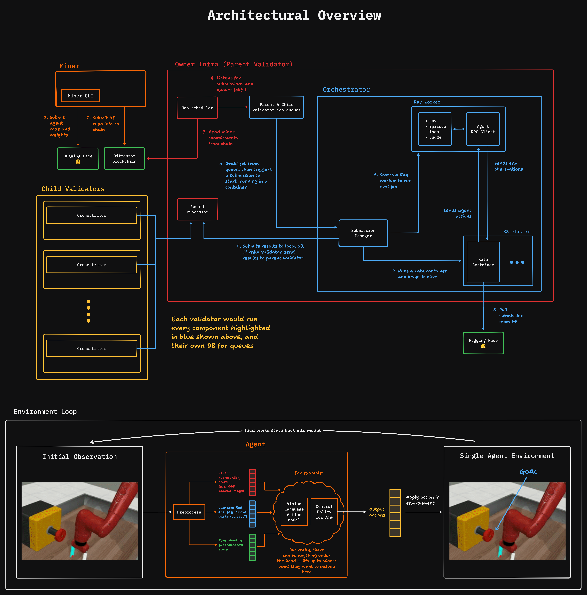

# Kinitro: Advancing Embodied Intelligence With Directed Incentives

Kinitro drives the future of robotic policy and planning models with incentivized competitions.

> [!NOTE]
> We'll be onboarding miners very soon. Please take a look at this repository and the [Kinitro agent template](https://github.com/threetau/kinitro-agent-template) to get an idea of how things work, and to start creating your miners. We are not running any validator code right now, so miners will not be given tasks.

## How it works

1. **Define**: Validators post a task with metrics and rewards.
2. **Compete**: Miners train and submit agents.
3. **Validate & reward**: Validators verify; payouts are automatic.

Below is an overview of the architecture:

## Incentive design

- **Task bounties**: More performance = more rewards.
- **Validator rewards**: Accurate, timely evaluations earn emissions.
- **Continuous improvement**: Benchmarks evolve. Miners adapt. The frontier advances.

## Contributing

We welcome contributions to enhance Kinitro. Please fork the repository and submit a pull request with your improvements.

## License

This project is licensed under the MIT License. See the [LICENSE](./LICENSE) file for details.

## Contact

For questions or support, please open an issue in this repository or contact the maintainers on the Kinitro or Bittensor Discord server.
