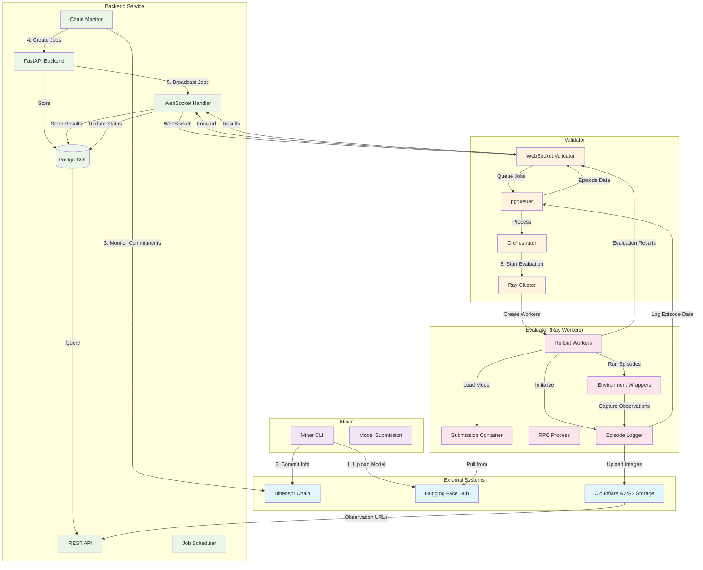

# Kinitro: Advancing Embodied Intelligence With Directed Incentives

Kinitro drives the future of robotic policy and planning models with incentivized competitions.

> [!NOTE]
> We'll be onboarding miners very soon. Please take a look at this repository and the [Kinitro agent template](https://github.com/threetau/kinitro-agent-template) to get an idea of how things work, and to start creating your miners. We are not running any validator code right now, so miners will not be given tasks.

## How it works

1. **Define**: Validators post a task with metrics and rewards.
2. **Compete**: Miners train and submit agents.
3. **Validate & reward**: Validators verify; payouts are automatic.
4. **Track**: Comprehensive episode logging and job status tracking provide full visibility into evaluation pipelines.

## Key Features

### 🎯 Comprehensive Evaluation Pipeline
- **Episode Logging**: Complete recording of agent episodes with configurable intervals
- **R2 Storage Integration**: Scalable observation storage with Cloudflare R2/S3 compatibility  
- **Real-time Tracking**: Live job status updates from queued to completed
- **Multi-task Support**: Isolated task execution with proper data separation

### 🔍 Full Observability
- **Episode Data API**: Access detailed episode metrics, rewards, and success rates
- **Job Status Tracking**: Monitor evaluation progress across validators
- **Storage References**: Direct links to observation data in cloud storage
- **Comprehensive Logging**: Structured logging throughout the evaluation pipeline

### 📊 Data Management
- **PostgreSQL Backend**: Robust data persistence with SQLModel/SQLAlchemy
- **Task Isolation**: Prevents data conflicts between concurrent evaluations
- **Configurable Intervals**: Control episode and step logging frequency
- **Cloud Storage**: Automatic observation upload to R2/S3 compatible storage

## Architecture Overview

The Kinitro system consists of three main components working together to create an incentivized evaluation platform:



### Component Responsibilities

**Backend Service**
- **FastAPI Backend**: REST API endpoints and WebSocket management
- **Chain Monitor**: Monitors Bittensor chain for miner commitments  
- **Job Scheduler**: Creates and distributes evaluation jobs
- **WebSocket Handler**: Real-time communication with validators
- **PostgreSQL**: Stores competitions, jobs, results, episode data

**Validator** 
- **WebSocket Validator**: Connects to backend, receives jobs
- **pgqueuer**: Asynchronous message processing for episode data
- **Orchestrator**: Manages evaluation lifecycle using Ray
- **Ray Cluster**: Distributed computing for parallel evaluations

**Evaluator (Ray Workers)**
- **Rollout Workers**: Execute agent episodes in environments
- **Episode Logger**: Records episode data and observations  
- **Environment Wrappers**: MetaWorld/Gymnasium integration
- **RPC Process**: Communication with agent containers
- **Submission Containers**: Isolated model execution environments

### Data Flow

1. **Model Submission**: Miners upload models to Hugging Face and commit metadata to Bittensor chain
2. **Job Creation**: Backend monitors chain, creates evaluation jobs for new submissions
3. **Job Distribution**: Jobs broadcast to validators via WebSocket connections  
4. **Evaluation Execution**: Validators use Ray to run distributed evaluations
5. **Episode Logging**: Observations uploaded to R2, episode data sent via pgqueuer
6. **Result Collection**: Evaluation results flow back to backend for storage and analysis

### Key Features

- **Real-time Communication**: WebSocket connections between backend and validators
- **Distributed Computing**: Ray-based parallel evaluation execution
- **Episode Tracking**: Complete logging of agent episodes with configurable intervals  
- **Cloud Storage**: Scalable observation storage using R2/S3
- **Job Status Tracking**: Real-time monitoring of evaluation progress
- **Task Isolation**: Prevents data conflicts between concurrent evaluations

## Incentive design

- **Task bounties**: More performance = more rewards.
- **Validator rewards**: Accurate, timely evaluations earn emissions.
- **Continuous improvement**: Benchmarks evolve. Miners adapt. The frontier advances.

## Installation

Below are the basic installation steps for miners and validators. More detailed docs will come soon.

1. **Clone the repository**:

    ```bash
    https://github.com/threetau/kinitro
    cd kinitro
    ```

2. **Set up environment and dependencies**:

    We need the following build dependencies:

    ```bash
    sudo apt install libpq-dev python3-dev
    ```

    Set up your Python environment:

    ```bash
    uv venv .venv
    source .venv/bin/activate
    uv sync --dev
    uv pip install -e .
    ```

## Contributing

We welcome contributions to enhance Kinitro. Please fork the repository and submit a pull request with your improvements.

## License

This project is licensed under the MIT License. See the [LICENSE](./LICENSE) file for details.

## Contact

For questions or support, please open an issue in this repository or contact the maintainers on the Kinitro or Bittensor Discord server.
