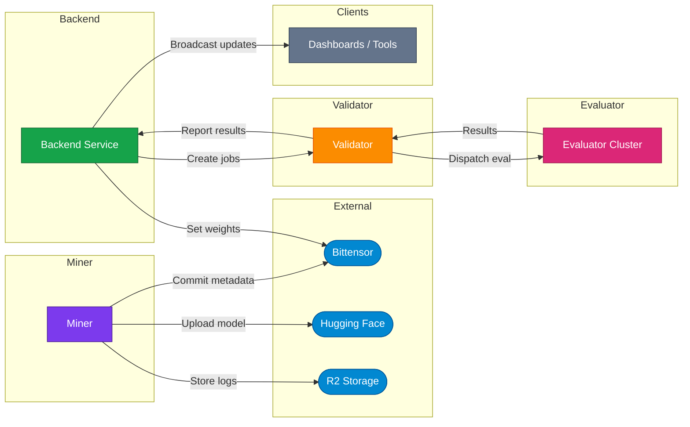

# Introduction

Kinitro incentivizes the emergence of agents that can conquer various tasks across different environments. Miners publish agents to compete, validators peform rollouts and evaluate the agents, and reward miners based on the results. All this happens in real-time and can easily be viewed by anyone through our [dashboard](https://kinitro.ai/dashboard).

## Platform Flow
1. **Submission** – A miner uploads an agent to Hugging Face and publishes a commitment on the Bittensor chain.
2. **Ingestion** – The backend monitors the chain, records new submissions, and schedules evaluation jobs.
3. **Distribution** – Validators connect to the backend over WebSockets, receive jobs, and persist them to a durable queue.
4. **Evaluation** – The evaluation orchestrator pulls queued jobs, spins up submission containers, runs Ray rollout workers, and logs every episode.
5. **Results & Incentives** – Validators forward metrics back to the backend, which stores them, emits realtime updates, and computes miner scores for weight broadcasts.

## System Architecture

## Component Responsibilities

**Backend Service**
- **FastAPI REST / Admin**: Hosts competition CRUD, submission views, stats, validator management, and WebSocket endpoints.
- **Chain Monitor & Scheduler**: Tracks Bittensor commitments, turns them into `BackendEvaluationJob` records, and watches for stale jobs.
- **Realtime Broadcaster**: Manages client subscriptions and pushes structured events such as job updates, episode completions, and live stats.
- **Scoring & Weight Engine**: Periodically recalculates miner scores and pushes weight updates back to validators for on-chain emission.
- **Backend PostgreSQL**: Source of truth for competitions, submissions, jobs, job status, results, stats, and validator connections.

**Validator Node**
- **WebSocket Client**: Authenticates with the backend, receives `EvalJobMessage` payloads, and streams results back.
- **pgqueuer Runner**: Persists jobs/results/episode logs in PostgreSQL so work survives restarts and can be retried.
- **Validator PostgreSQL**: Stores pgq queues plus normalized tables for jobs, results, and metrics consumed by the evaluator.

**Evaluator Cluster**
- **Evaluator Orchestrator**: Listens to the pgqueuer queue, enforces concurrency caps, and coordinates job lifecycles.
- **Submission Pods**: Kubernetes pods created per submission to run miner containers in isolation.
- **Ray Rollout Workers**: Execute benchmark episodes, communicate with submission pods via RPC, and track success metrics.
- **Episode Logger**: Captures per-episode and per-step data, uploads media to R2, and enqueues telemetry for validator forwarding.

**Miner Tooling**
- **Miner CLI**: Packages models, uploads to Hugging Face, and notarizes commitments on-chain so the backend can discover them.

**Real-time Clients**
- Subscribe to the backend’s public WebSocket endpoint to monitor competitions, validator connectivity, and evaluation progress live.

## Next Steps
- Dive into the [Validator architecture notes](orchestrator.md) to see how the queue, database, and message formats interact.
- Review the [Evaluator internals](evaluator.md) for details on Ray workers, RPC bridges, and logging pipelines.
- Check the [Incentive mechanism](incentive.md) to understand how scores flow into weight updates.
